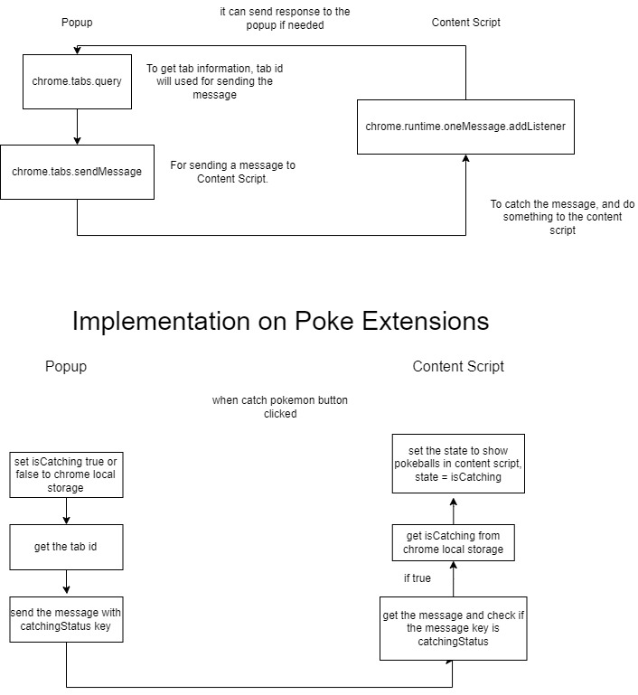

## Pokemon Extension

This is text based pokemon game for learn to build a extension

<!-- GETTING STARTED -->

## Getting Started

### 1. Download starter and install dependencies

Clone this repository:

```
git clone https://github.com/juanfrederick/pokemon-extension.git
```

Install npm dependencies:

```
cd pokemon-extension
npm install
```

### 2. Build the Extension

#### Start the dbjson server

```
npm run server
```

#### Start the Webpack Development Server

```
npm run dev
```

#### Build the Production-Ready Extension

```
npm run build
```

The relevant web extension files will be present in the output `.dist/` folder.

## What did i learn from building this extension

#### 25 September 2023

```
Creating popup design (sign in and signup). I try to use redux to popup, and i think redux can't be applied because on redux dev tools not showing any state that i made. But redux still work on popup extention even not showing on redux dev tools.
```

#### 26 September 2023

```
Finding out to use content script for show the pokeballs to the web, trying to render the pokeballs using DOM but i cannot do that, because there's error. So i changed the file to tsx and try to make it like react root structure. at first i just copy the react root structure to the index, but it changed all the web content not add new content. So i make a new div and append to the body and it works. For the style, i see the usertip builder extention (make the width and height 100%, position fixed, and set the pointer event to none) i try this before, but i can't click anything in the web because the pointer event still auto.

Problem:
Default contentScript files type is .ts, and it's hard to implementing the ReactDOM to .ts files

Solution:
Change the ts to tsx files and change webpack contentScript bundle files to tsx too. For rendering, create div element and appendChild to body, and make that div as a root of ContentScript.

---

Problem:
Can't use chrome. library in content script and popup files

Solution:
Install @types/chrome using npm and add compilerOptions.types "chrome" in tsconfig.json
```

#### 27 September 2023

```
I try to following the documentation, using async await for passing the message. But it cannot working, so i try to use the callback one, finding out that (lastFocusedWindow: true) does'nt returning any object, so i change it to (currentWindow: true). Still curious about the async await one, so i try to search the solution and finding out that async await is for manifest version 3 only. so i update my manifest.json version to 3. I try to send the message to the content script but it's error, it because i haven't add the chrome.runtime.onMessage.addListener in content script. when i add that, the message can be passed to content script.


Problem:
Cannot using await for passing message from popup to content script

Solution:
Using callback or changing to manifest 3
```

#### 29 September 2023

```
I using redux in content-script for manage the state, and it's working even the redux dev tools not showing the state. The content-script and popup state will different even have the same store. I think it's because the provider is warping different child.
```

#### 2 October 2023

```
I'm using localstorage for saving user data, but every website have different storage, so the data will always different on every website. So i'm using chrome.storage.local for saving user data, i change all localstorage to chrome.storage.local on the code.

Problem:
data value will changed when website is change

Solution:
use chrome.storage.local to save the data to the chrome, not the website only
```

## The Extension flow/architecture that i understand



Extension that i made is just connecting content script to popup script, for the data fetching i do directly in the content script or popup script and save it to each redux state
